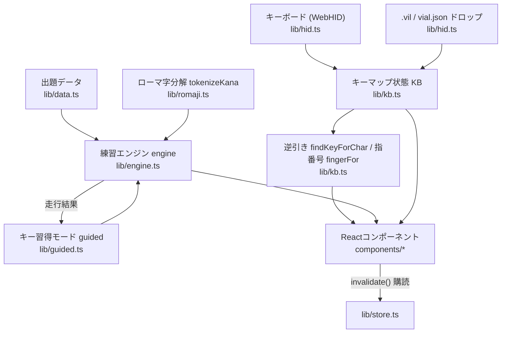
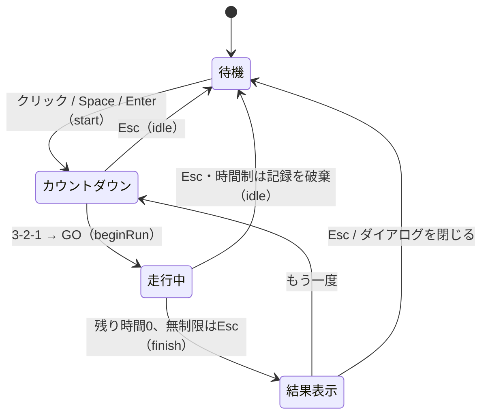
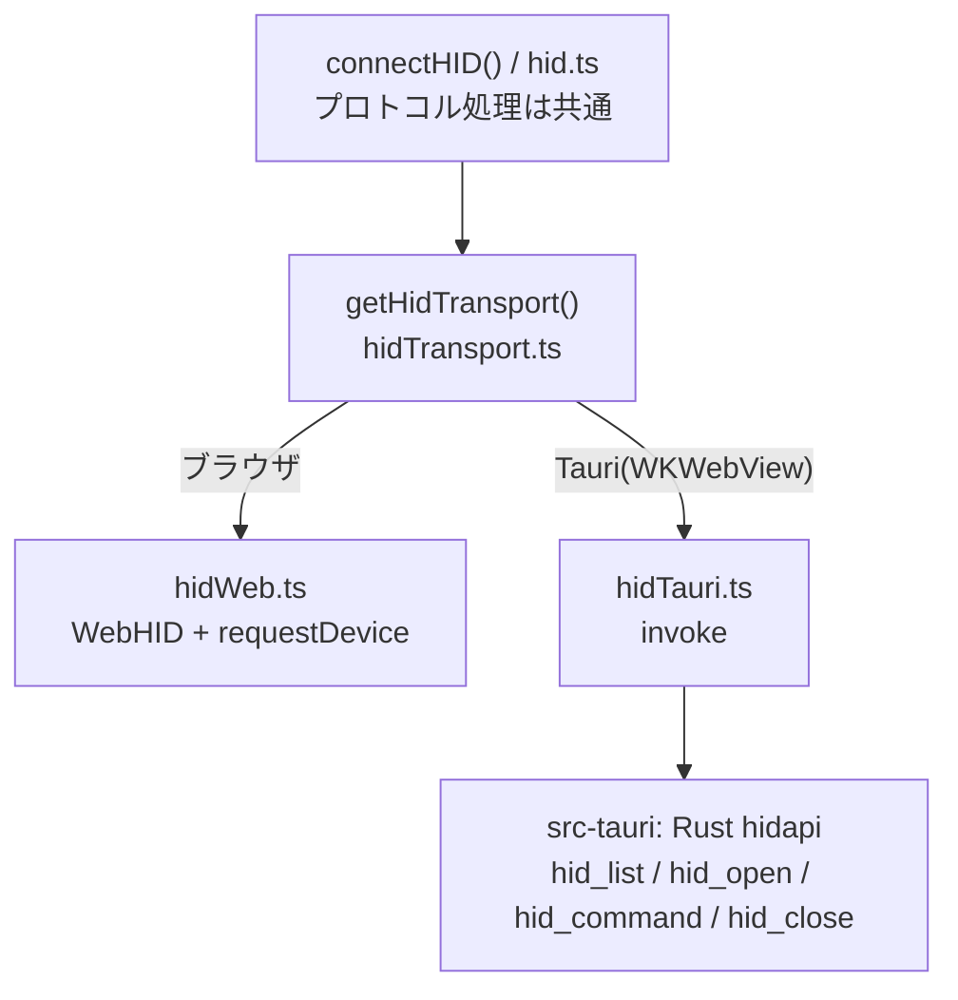
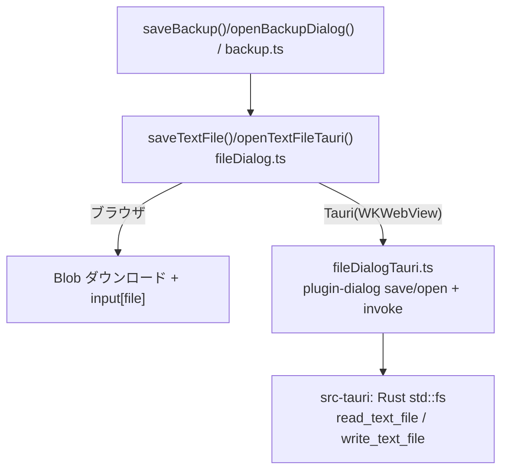

# ソースコード全体構造

Vial Typing のアプリケーション本体。Vial 対応キーボードからレイアウト定義とキーマップを読み取り、
「次に押すべき物理キー」を案内しながらタイピング練習をさせる。
Vite + React + TypeScript 構成で、`npm run build` で `dist/` へバンドルされる。
出題データ（`src/data/*.json`）と xz/lzma デコーダ（npm 依存）もバンドルに含まれ、実行時の外部取得は無い。

## アーキテクチャ

状態は `src/lib/` のモジュールが plain なミュータブルオブジェクトとして持ち、
変更後に `invalidate()`（`lib/store.ts`）を呼ぶと React が `useSyncExternalStore` 経由で再描画される。
コンポーネント（`src/components/`）は状態を読んで宣言的に描画するだけで、自前の状態をほぼ持たない。
エンジンやキーマップのロジックは React 非依存なので、単体でテスト・再利用できる。

## src/lib/ — ロジックと状態

| モジュール | 役割 |
|---|---|
| `store.ts` | 再描画通知（`invalidate`/`subscribe`）と共通UI状態 `ui`（ステータスピル・読み取りログ・ドロップ表示） |
| `backup.ts` | 現在の状態（キーマップ＋練習記録）を1つのJSONファイルへ書き出し／読み戻し。端末・ブラウザ間の移行用（詳細は後述） |
| `platform.ts` | 実行環境判定 `isTauri()`（`__TAURI_INTERNALS__` の有無）。Tauri専用モジュールの動的import切替に使う |
| `fileDialog.ts` | テキストファイルの保存/読込の抽象 `saveTextFile()`/`openTextFileTauri()`。web=Blob/`<input>`、Tauri=OSダイアログ |
| `fileDialogTauri.ts` | Tauri実装。`plugin-dialog` の保存/開くパネルでパスを選び、読み書きはRust独自コマンドへ `invoke`。isTauri時のみ動的import |
| `settings.ts` | ユーザー設定 `settings`（配列解釈・入力案内・ローマ字スタイル・効果音・プレイ時間）と localStorage 復元 |
| `data.ts` | 出題コーパス（英単語・英文・日本語単語・日本語文・記号行）の import |
| `layout.ts` | KLE データの型と `parseKLE()`（物理キー配列への変換） |
| `keycodes.ts` | HID/QMK キーコード表、`decodeNum()`・`parseVil()`（数値/.vil文字列 → `KeyDef`）、刻印 `legendFor()` |
| `defaultKeyboard.ts` | キーマップ未読込時に使う既定キーボード `DEFAULT_KEYBOARD`（標準USテンキーレス61キー配列・1レイヤー） |
| `romaji.ts` | かな → ローマ字候補表 `ROMAJI`、スタイル切替 `applyRomajiStyle()`、`tokenizeKana()` |
| `kb.ts` | キーボード状態 `KB`（物理配置＋キーマップ＋表示レイヤー）、保存/復元、逆引き `findKeyForChar()`、指番号 `fingerFor()` |
| `guided.ts` | キー習得モードの統計・コース別解放判定・出題プール（詳細は後述） |
| `engine.ts` | 練習エンジン `engine`（走行のステートマシン。詳細は後述） |
| `hid.ts` | Vial/VIA プロトコルのキーマップ読み取り `connectHID()`、`.vil`/vial.json 取り込み `loadVilText()`。送受信は `HidTransport` 越し |
| `hidTransport.ts` | HIDトランスポートの抽象と実行時選択 `getHidTransport()`（下記「デスクトップ対応」参照） |
| `hidWeb.ts` | WebHID(Chrome/Edge)実装。`requestDevice` のネイティブダイアログでデバイス選択 |
| `hidTauri.ts` | Tauri実装。Rust側(hidapi)へ `invoke` で委譲。isTauri時のみ動的import |
| `devicePicker.ts` | Tauri用のデバイス選択UIの橋渡し（`requestDevicePick` が Promise を返す） |
| `audio.ts` | WebAudio による効果音合成（素材ファイル無し） |
| `hint.ts` | 「次に打つ文字とその打ち方」の導出 `currentExpected()` |

### 逆引きと指番号（kb.ts）

- `findKeyForChar()`: 文字 → `{key, layer, shiftKey, layerKey, alt}`。全レイヤーの候補をスコアリング
  （ホールド数・レイヤー深さ・設定 `keyPref`/`layerPref` で重み付け）して最良と別案を返す。
  `charCache` にメモ化され、設定やキーマップ変更時に破棄される。
- `findShiftKey()`: Shift がレイヤー切替前にしか無い場合は「Shift 先押し」(`fromBase`) として扱う。
- `fingerFor()`: 物理配置から指番号（1=親指〜5=小指、ピアノ運指式）を推定。盤面中央で左右に分け、
  分割型は各半分の最終行を親指、残りは列単位で内側から人差し指×2列・中指・薬指・外側を小指とする。

### キー習得モード（guided.ts）— keybr.com 方式のキー解放

keybr.com の guided lesson の移植。1 走行を 1 レッスンとしてキー別の打鍵統計を取り、
習熟したキーから順に「解放」して出題を変えていく。通常⇔キー習得はモード切替（`engine.guided`）で、
練習モード（英語・日本語・記号・ミックス）と直交して組み合わせられる。

- コース（`GUIDED_COURSES`）: 解放順は練習モードごとの「コース」= 対象キー集合＋そのコーパスでの頻度順。
  英語は英単語+英文の英字頻度、日本語は日本語単語を標準ローマ字化した英字頻度、
  記号コースは記号行コーパスの英字トラックと記号・数字トラックの 2 本を持つ。
  **打鍵統計はコース間で共有**され、解放済み集合と注目キーだけがコースごとに変わる。
- 統計: 走行ごとにキー別の `[打鍵数, ミス数, 平均打鍵時間]` を記録（`guidedRecordRun`）。
  現在速度は走行間の指数平滑（`GUIDED_ALPHA = 0.1`）、自己ベストはその最小値（`guidedRebuildStats`）。
- 信頼度: `目標打鍵時間 ÷ 平滑打鍵時間`。目標は 175CPM = 35WPM（`GUIDED_TARGET_TIME`）。1.0 以上で「習得済み」。
- 解放判定（`guidedTrackKeys`）: トラックごとに頻度順で走査し、①最初の 6 キーは常に解放
  ②自己ベスト信頼度 1.0 到達キーは維持 ③解放済みが全て 1.0 に達したときだけ次の 1 キーを解放。
  最弱キーを「注目キー」にする。
- 出題（`guidedBuildPools`）: 各コースの解放済み集合でプールを作る。不足分は疑似単語・疑似かな・
  解放済み記号で識別子をつないだ生成行で補う。ミックスはお題の種別ごとに対応コースのプールを使う。
- 永続化: localStorage `vialTypingGuided` に直近 300 走行分を保存。

### 練習エンジン（engine.ts）

`engine` オブジェクトが走行の全状態を持つステートマシン。DOM には触れず、
タイプライン・統計・ヒントはすべてコンポーネント側が状態から導出する。

- 出題: `makeItem()` がモード（en/jp/sym/mix）に応じて選ぶ。キー習得モード中は解放済みキーのプールに
  差し替える。`drawFrom()` はシャッフル済みの袋から引いて偏りと連続重複を防ぐ。
- 入力: `input()` → 英文系 `inputText()`／日本語 `inputJP()`。日本語は unit 単位でローマ字候補と
  前方一致照合し、「ん」の n 1 打ち確定（`softDone` → `finishUnit`）も扱う。
  `expect()` が次に打つべき 1 文字を返し、ヒント表示と打鍵記録（`recordStep`）が使う。
- 走行制御: `start()`（カウントダウン）→ `beginRun()` → 100ms 毎の `tick()` →
  `finish()`（スコア集計と `result` 設定。キー習得モードは打鍵記録の確定）／`idle()`。
- コンボボーナス: 30 連続正解ごとに +1 秒（無制限モードでは付与しない）。
- `runSeconds`: 30/60/90 秒、0 は無制限（Esc で終了して結果表示）。

### 状態のバックアップ（backup.ts）

localStorage はオリジンごとに分離される（web版とTauri版・別ブラウザで非共有）ため、
現在の状態を1つのJSONファイルに書き出して他環境へ移せるようにしている。

- 対象: **キーマップ**（`kb.ts` の `keymapSnapshot()` = localStorage `vialTypingKeymap` と同じ形）・
  **練習記録**（`guided.ts` の走行履歴）・**設定**（`settings.ts` の `cornix*` 一式）。
  設定は先に反映してから（レイヤー固定をキーマップ適用時のレイヤー数チェックに乗せるため）
  キーマップ・練習記録を取り込み、最後に `engine.idle()` で走行を仕切り直す。
- ファイル形式: `{ app:"vial-typing", kind:"backup", version, exportedAt, keymap, guided, settings }`。
  **トップレベル `version` が形式のバージョン**で、書き出し時に必ず付与する。読み込み時は `migrateBackup()` が
  `version` を見て現行版へ移行し、自分より新しい `version` のバックアップは復元しない（古い版で壊れた復元をしないため）。
- 復元は現在のキーマップと練習記録を**置き換える**。既存の練習記録が消える場合のみ確認ダイアログを出す。
  取り込んだキーマップは localStorage にも保存され、次回起動時も自動復元される。
- 入口: `Header` の「💾 保存」「📂 復元」ボタン、および `.vil`/vial.json と同じドラッグ＆ドロップ。
  ドロップ／ファイル選択は `loadFileText()` が中身を見て、バックアップなら `importBackup()`、
  それ以外は `.vil`/vial.json として `loadVilText()` へ振り分ける。
- 保存/読込のファイル入出力は `fileDialog.ts` で抽象化し、`isTauri()` で実装を切り替える:
  ブラウザは `Blob` ダウンロードと `<input type=file>`、Tauri は OSネイティブの保存/開くダイアログ
  （`plugin-dialog`）＋Rust独自コマンド。保存は `saveBackup()`、Tauriの復元は `openBackupDialog()`。

## src/components/ — React コンポーネント

| コンポーネント | 描画対象 |
|---|---|
| `useApp.ts` | `invalidate()` を購読するフック（`useSyncExternalStore`。App が購読しツリー全体を再描画） |
| `App.tsx` | 全体レイアウト、グローバル keydown・ドラッグ&ドロップ、表示レイヤー自動切替 |
| `Header.tsx` | タイトル・ステータスピル・読み取り/開く/消すボタン |
| `Toolbar.tsx` | モード切替・練習モード・プレイ時間・設定セレクト群 |
| `StatBar.tsx` | 残り時間(経過時間)・WPM・正確率・コンボ・ミス・+1s ポップ |
| `GuidedPanel.tsx` | キー習得パネル（コースタブ・キーチップ・詳細・グラフ） |
| `keyChartDraw.ts` | キー別速度推移グラフの canvas 描画（散布図＋平滑曲線＋目標線） |
| `TypePanel.tsx` | 出題表示・タイプライン・操作ヒントチップ（指番号付き）・次語キュー |
| `KeyboardPanel.tsx` | キーボード図（キー配置・刻印・ハイライト・指番号バッジ）・読み取りログ |
| `ResultDialog.tsx` | 結果ダイアログ（スコア・ランク・キー解放アナウンス） |

再描画はキーストロークと 100ms のタイマー毎に全体で走るが、UI が小さいので問題にならない。
canvas グラフだけは選択キーのオブジェクト同一性を effect の依存にして、統計が変わったときのみ再描画する。
キーボード盤面も `useMemo`（依存: ヒント・キーマップ参照・レイヤー・コンテナ幅）で、tick では組み立て直さない。

## スタイル

共通スタイル（テーマ変数・リセット・ページ骨格・ボタン共通）は `src/styles/base.css` に置き、
`main.tsx` が最初に import して cascade の土台を固定する。コンポーネント固有のスタイルは
`src/components/<名前>.css` として各コンポーネントの隣に置き、その `.tsx` が import する（コロケーション）。
クラス名はグローバルのままなので、E2E テストのセレクタや DOM 構造には影響しない。

## 起動処理（src/main.tsx）

キー習得モードの履歴読込（`guidedLoad` → `guidedRebuildStats` → `guidedUpdateKeys`）→
保存済みキーマップの復元（`restoreSavedKeymap`。無ければ既定のUS配列キーボード `lib/defaultKeyboard.ts` のまま）→
`createRoot` で `<App />` をマウント。以降の画面更新はすべて `invalidate()` 経由。

## デスクトップ対応（Tauri / macOS）

同じフロントエンドを Tauri で包んで macOS アプリ (.app) にもできる（`src-tauri/`）。
ネックは **WKWebView が WebHID 非対応**な点で、`navigator.hid` が存在しない。
そのため HID アクセスだけをトランスポートとして抽象化してある:

- 実行時に `__TAURI_INTERNALS__` の有無で web/Tauri 実装を選ぶ。Tauri 実装は動的 import なので
  **web バンドルに `@tauri-apps/api` は含まれない**（xz/lzma と同じコード分割）。
- プロトコル処理（FE00/01/02 の定義読み取り・レイヤー数・キーマップバッファ・リトライ・即クローズ）は
  トランスポート非依存で 1 本のまま。差分は「32 バイト送って 1 レポート待つ」窓口だけ。
- Rust 側（`src-tauri/src/lib.rs`）は `hidapi` で usage_page=0xFF60/usage=0x61 を列挙・開閉し、
  `hid_command` が `write`＋`read_timeout` する 4 コマンド。Chrome のデバイス選択ダイアログが無いので、
  複数台時は `DevicePicker` コンポーネントの選択ダイアログを出す。
- 起動: `npm run tauri:dev`、ビルド: `npm run tauri:build`（`dist/` を包んで .app/.dmg 化）。
- localStorage はオリジンごとなので、web版とapp版で習得履歴・保存キーマップは共有されない。
  この移行手段が状態バックアップ（`backup.ts`）で、ファイル保存/読込も同じく実行時に切り替える。

**ファイル保存/開くも同型の抽象**（`fileDialog.ts`）。WKWebView は `Blob` ダウンロード非対応で、
`dragDropEnabled:false` によりドロップも使えないため、Tauri時はOSネイティブのパネルに差し替える:

- パネル表示は Tauri 公式 `dialog` プラグイン（`@tauri-apps/plugin-dialog` / `tauri-plugin-dialog`。
  capability に `dialog:default`）。ファイルI/OはHIDと同じく独自コマンドなので追加権限は不要。
- Tauri 実装（`fileDialogTauri.ts`）は動的 import。web バンドルに `@tauri-apps/plugin-dialog` は入らない。
- web の復元は `<input type=file>` を直接 click（ユーザージェスチャ維持）、Tauri は開くダイアログ。

## localStorage キー一覧

| キー | 内容 |
|---|---|
| `vialTypingKeymap` | 読み取ったレイアウト定義＋キーマップ（次回自動復元） |
| `vialTypingGuided` | キー習得モードの走行履歴（直近 300 件） |
| `cornixTime` | プレイ時間（0/30/60/90） |
| `cornixOutMode` | 配列解釈（us/jis） |
| `cornixPref` | 入力案内の優先（auto/shift/layer） |
| `cornixRomaji` | ローマ字の案内表記（hepburn/kunrei） |
| `cornixNumLayer` / `cornixSymLayer` | 数字/記号のレイヤー固定 |
| `cornixSound` | 効果音 ON/OFF |
