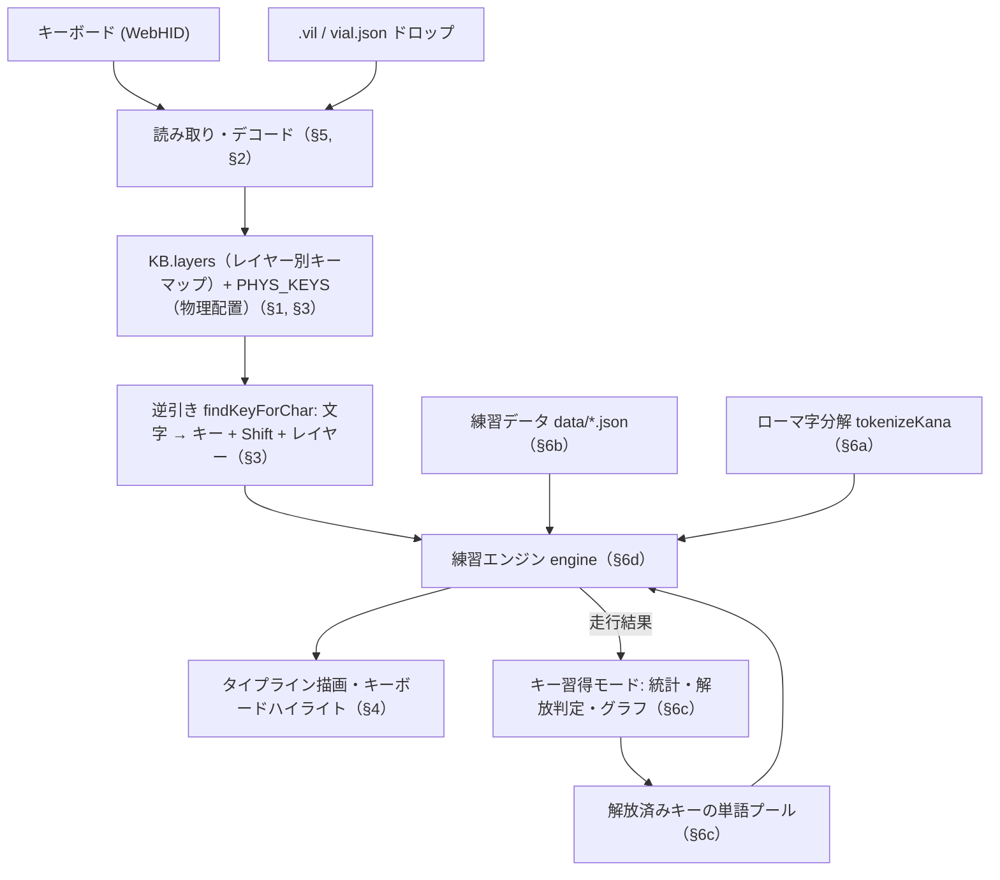
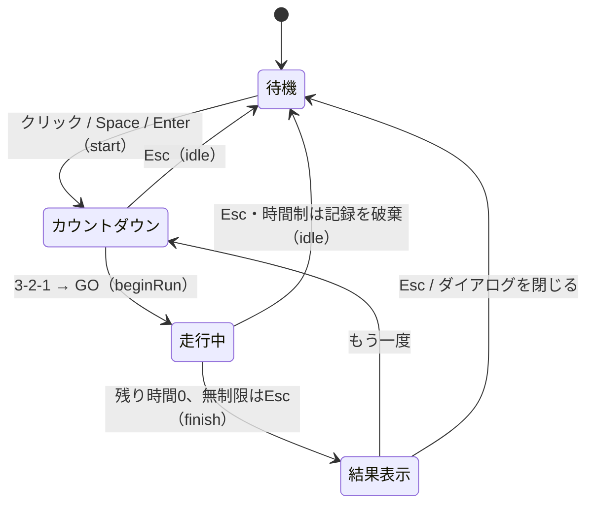

# app.js 全体構造

Vial Typing のアプリケーション本体。Vial 対応キーボードからレイアウト定義とキーマップを読み取り、
「次に押すべき物理キー」を案内しながらタイピング練習をさせる、単一ファイルの ES module。
`index.html` から `<script type="module" src="app.js">` で読み込まれ、ビルドや外部ライブラリに依存しない
（xz/lzma の展開のみ実行時に CDN から取得する）。

## データフロー

ソース内のセクションコメント（`/* ---------- N. ... ---------- */`）に沿って構成は以下の通り。

## 1. Physical layout — 物理レイアウト

- `KLE`: Cornix の vial.json 由来の KLE (Keyboard Layout Editor) データ。初期表示用のデフォルト。
- `parseKLE()`: KLE 配列を `{row, col, x, y, w, h, r, rx, ry}` の物理キー配列 `PHYS_KEYS` に変換。
  エンコーダ・装飾キー・非デフォルトのレイアウトオプションは除外する。
- `applyDefinition()`: 任意の vial.json 形式定義（`{name, matrix, layouts.keymap}`）を適用して
  `MATRIX_ROWS/COLS`・`PHYS_KEYS`・キーボード名を差し替える汎用入口。
- `getXz()` / `decompressDefinition()`: ファームウェア内蔵定義（xz または LZMA_ALONE 圧縮 JSON）を
  CDN から取得したデコーダで展開する。

## 2. Keycode tables & decoding — キーコード表とデコード

- `HID_CHARS` / `HID_CHARS_JIS`: HID usage → `[非Shift文字, Shift文字]`。`outMode`（"us"/"jis"）で
  「OS とファームウェアの配列解釈」を切り替え、`charsOf()` が現在モードの表を引く。
- `KEYLABELS` / `KC_NAMES`: 表示ラベルと `KC_*` 名 → コードの対応表。
- `decodeNum()`: QMK/Vial の 16bit 数値キーコードを `{t, ...}` オブジェクトにデコード
  （`kc`/`mo`/`lt`/`mt`/`osm`/`tg` など。`K_NONE`・`K_TRANS` は共有定数）。
- `parseVil()`: .vil ファイルの文字列キーコード（`"KC_A"`, `"MO(1)"`, `"LSFT(KC_1)"` 等）を同じ形式にパース。

## 3. Keymap state & reverse lookup — キーマップ状態と逆引き

- `KB`: 現在のキーマップ（`layers[L][r][c]`、レイヤー数、読込元）。
- `setKeymap()`: キーマップ差し替えの唯一の入口。キャッシュ破棄・タブ再構築・ステータス表示・
  localStorage への保存（`saveKeymap`）まで行う。`restoreSavedKeymap()` が起動時に前回状態を復元。
- 逆引きの部品:
  - `effKey()`: `KC_TRNS` をベースレイヤーへ透過させた実効キー。
  - `findShiftKey()` / `findLayerKey()`: Shift を出せるキー、目的レイヤーへ入るキーの探索。
    Shift がレイヤー切替前にしか無い場合は「Shift 先押し」(`fromBase`) として扱う。
  - `findKeyForChar()`: 文字 → `{key, layer, shiftKey, layerKey, alt}`。全レイヤーの候補を
    スコアリング（ホールド数・レイヤー深さ・ユーザー設定 `keyPref`/`layerPref` で重み付け）して
    最良と別案を返す。結果は `charCache` にメモ化し、設定やキーマップが変わると破棄される。

## 4. Keyboard rendering — キーボード描画

- `renderKeyboard()`: `PHYS_KEYS` から DOM を生成し、回転クラスタを含む座標系をウィンドウ幅にフィット。
- `legendFor()` / `updateLegends()`: 表示レイヤーのキーごとの刻印（`shiftedSub` が Shift 側文字の小表示）。
- `buildLayerTabs()` / `setViewLayer()`: レイヤー切替タブ。ヒント表示時は自動で該当レイヤーへ切替。
- `paintHint()`: 案内対象キー（押すキー・Shift・レイヤーキー）のハイライト。

## 5. WebHID + .vil import — キーマップの読み取り

- `connectHID()`: Vial/VIA プロトコル本体。`FE 00/01/02` でファームウェア内蔵のレイアウト定義を
  ブロック読みして展開・適用し、`0x11`（レイヤー数）と `0x12`（キーマップバッファ）で全レイヤーを取得。
  読み取り後は Vial 本家が接続できるようデバイスを即クローズする。経過は `dlog()` で読み取りログに残す。
- `loadVilText()`: ドロップ/ファイル選択された JSON を判別し、vial.json ならレイアウト定義として、
  .vil ならキーマップとして適用（末尾の空レイヤーは削除）。
- ファイル入力とウィンドウ全体のドラッグ&ドロップの配線もこのセクションにある。

## 6a. Romaji engine — ローマ字エンジン

- `ROMAJI`: かな → ローマ字候補の表（ヘボン式・訓令式の両対応、拗音は自動生成）。
- `tokenizeKana()`: かな文字列を入力単位（unit）列に分解。「っ」は次の子音の重ねと `ltu/xtu/ltsu`、
  「ん」は次の文字に応じて `n`/`nn`/`xn` を許容するなど、文脈依存の候補を展開する。

## 6b. Practice data — 練習データ

- `data/*.json`（英単語・英文・日本語単語・日本語文・記号行）を `fetch` で並列読込。
  top-level await のため、**ここで失敗すると以降は実行されない**（ステータスにエラーを表示して停止。
  `file://` では動かないので `make run` の http サーバー経由で開く）。

## 6c. キー習得モード — keybr.com 方式のキー解放

keybr.com の guided lesson の移植。1 走行を 1 レッスンとしてキー別の打鍵統計を取り、
習熟したキーから順に「解放」して出題を変えていく。通常⇔キー習得はモード切替（`engine.guided`）で、
練習モード（英語・日本語・記号・ミックス）と直交して組み合わせられる。

- コース（`GUIDED_COURSES`）: 解放順は練習モードごとの「コース」= 対象キー集合＋そのコーパスでの頻度順。
  英語は `EN_WORDS`+`EN_SENTS` の英字頻度、日本語は `JP_WORDS` を標準ローマ字化した英字頻度、
  記号コースは `SYM_ITEMS` の英字トラックと記号・数字トラックの 2 本を持つ。
  **打鍵統計はコース間で共有**され（k を打つ速さはモード非依存）、解放済み集合と注目キーだけが
  コースごとに変わる。

- 統計: 走行ごとにキー別の `[打鍵数, ミス数, 平均打鍵時間]` を記録（`guidedRecordRun`）。
  キーの現在速度は走行間の指数平滑（`GUIDED_ALPHA = 0.1`）、自己ベストはその最小値（`guidedRebuildStats`）。
- 信頼度: `guidedConfidence = 目標打鍵時間 ÷ 平滑打鍵時間`。目標は 175CPM = 35WPM（`GUIDED_TARGET_TIME`）。
  1.0 以上でそのキーは「習得済み」。
- 解放判定（`guidedTrackKeys`）: トラックごとに頻度順で走査し、
  ①最初の 6 キーは常に解放 ②自己ベスト信頼度 1.0 到達キーは維持
  ③解放済みが全て 1.0 に達したときだけ次の 1 キーを解放。最弱キーを「注目キー」にする。
- 出題（`guidedBuildPools`）: 各コースの解放済み集合でプールを作る。英語は解放済みキーだけで綴れて
  注目キーを含む `EN_WORDS`、日本語は標準ローマ字（`guidedRomajiOf`）が解放済みキーだけで打てる
  `JP_WORDS`、記号は英字・記号の両トラックに収まる `SYM_ITEMS`。不足分は疑似単語・疑似かな・
  解放済み記号で識別子をつないだ生成行で補う。ミックスはお題の種別ごとに対応コースのプールを使う。
  統計はどの練習モードでも打鍵された追跡対象キー（大文字は小文字に畳む）に対して記録される。
- 表示: コースタブ（練習モード変更に自動追従、ミックス中は自由選択）で表示コースを切り替え、
  `renderKeySet()`（トラックごとのチップ行。信頼度で赤→緑、未解放は斜線、注目キーは枠強調）、
  `renderKeyInfo()`（直前/ベスト速度・学習率）、`drawKeyChart()`（canvas 2D で走行ごとの速度散布図＋
  平滑曲線＋目標線＋「今」マーカー）。まとめて `guidedRenderAll()`。
- 永続化: localStorage `vialTypingGuided` に直近 300 走行分を保存。

## 6d. Engine — 練習エンジン

`engine` オブジェクトが走行の全状態を持つステートマシン。

- 走行制御: `start()`（3-2-1 カウントダウン）→ `beginRun()`（出題列生成・タイマー開始。キー習得モードは
  ここで単語プールを再構築）→ `tick()`（100ms 毎。残り時間 or 無制限モードは経過時間を表示）→
  `finish()`（スコア・ランク集計、結果ダイアログ、キー習得モードは打鍵記録の確定）／`idle()`（待機画面へ）。
- 出題: `makeItem()` がモード（en/jp/sym/mix）に応じて選ぶ。キー習得モード中は各モードの出題を
  解放済みキーのプール（§6c）に差し替える。`drawFrom()` はシャッフル済みの袋（`bags`）から
  引くことで偏りと連続重複を防ぐ。
- 入力: キーは `input()` → 英文系 `inputText()`／日本語 `inputJP()`。日本語は unit 単位で
  ローマ字候補と前方一致照合し、「ん」の n 1 打ち確定（`softDone` → `finishUnit`）も扱う。
  `expect()` が次に打つべき 1 文字を返し、ヒントと打鍵記録（`recordStep`）が使う。
- 表示: `render()`（打ち終わり/現在/残りの 3 スパン + 次語キュー）、`refreshHint()`
  （`findKeyForChar` の結果を操作手順のチップ表示とキーボードハイライトに反映。
  キーマップに無い文字は Enter でスキップ＝`skipChar()`）、`updateStats()`（WPM = 正解打鍵/5/分、正確率等）。
- その他: コンボボーナス（30 連続正解ごとに +1 秒。無制限モードでは付与しない）、
  `audio`（WebAudio でタイプ音・ミス音・ボーナス音を合成。素材ファイル無し）。
- `runSeconds`: 30/60/90 秒、0 は無制限（Esc で終了して結果表示）。

## 6e. Input & UI wiring — 入力と UI の配線

- `document` の keydown 一本で処理: Esc（走行中断/無制限の終了）、Space/Enter（開始）、
  Enter（スキップ）、1 文字キー（`engine.input`。JIS の ¥ は \\ に正規化）。
- モード切替（通常/キー習得。パネル表示も切り替え）・練習モードボタン・プレイ時間ボタン
  （localStorage `cornixTime` に保存）・配列/入力案内/レイヤー固定の各セレクト・サウンドトグル・
  「もう一度」・vial.json 保存ボタンのイベント配線。

## startup — 起動処理

保存済みキーマップの復元（無ければプレースホルダ表示）→ サウンドボタン初期化 →
キー習得モードの履歴読込と解放状態の計算 → 待機画面表示。ウィンドウリサイズ時はデバウンスして
キーボード再描画とグラフ再描画を行う。

## localStorage キー一覧

| キー | 内容 |
|---|---|
| `vialTypingKeymap` | 読み取ったレイアウト定義＋キーマップ（次回自動復元） |
| `vialTypingGuided` | キー習得モードの走行履歴（直近 300 件） |
| `cornixTime` | プレイ時間（0/30/60/90） |
| `cornixOutMode` | 配列解釈（us/jis） |
| `cornixPref` | 入力案内の優先（auto/shift/layer） |
| `cornixNumLayer` / `cornixSymLayer` | 数字/記号のレイヤー固定 |
| `cornixSound` | 効果音 ON/OFF |

## 主要なグローバル状態

| 名前 | セクション | 役割 |
|---|---|---|
| `PHYS_KEYS` / `MATRIX_ROWS,COLS` / `KBDEF` | §1 | 物理配置とキーボード情報 |
| `outMode` | §2 | US/JIS の文字解釈 |
| `KB` | §3 | 現在のキーマップ |
| `charCache` / `keyPref` / `layerPref` | §3 | 逆引きキャッシュと案内設定 |
| `viewLayer` / `keyEls` | §4 | 表示中レイヤーと DOM 参照 |
| `EN_WORDS` ほか練習データ | §6b | 出題コーパス |
| `guided` | §6c | キー習得モードの統計・解放状態 |
| `engine` | §6d | 走行状態（唯一のステートマシン） |
| `runSeconds` / `soundOn` / `bags` | §6d | 走行設定と出題袋 |
