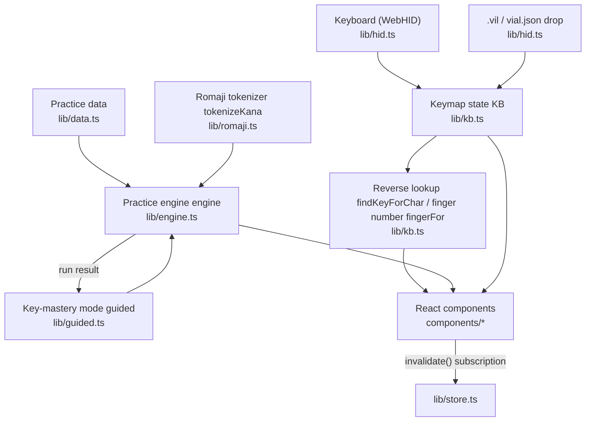
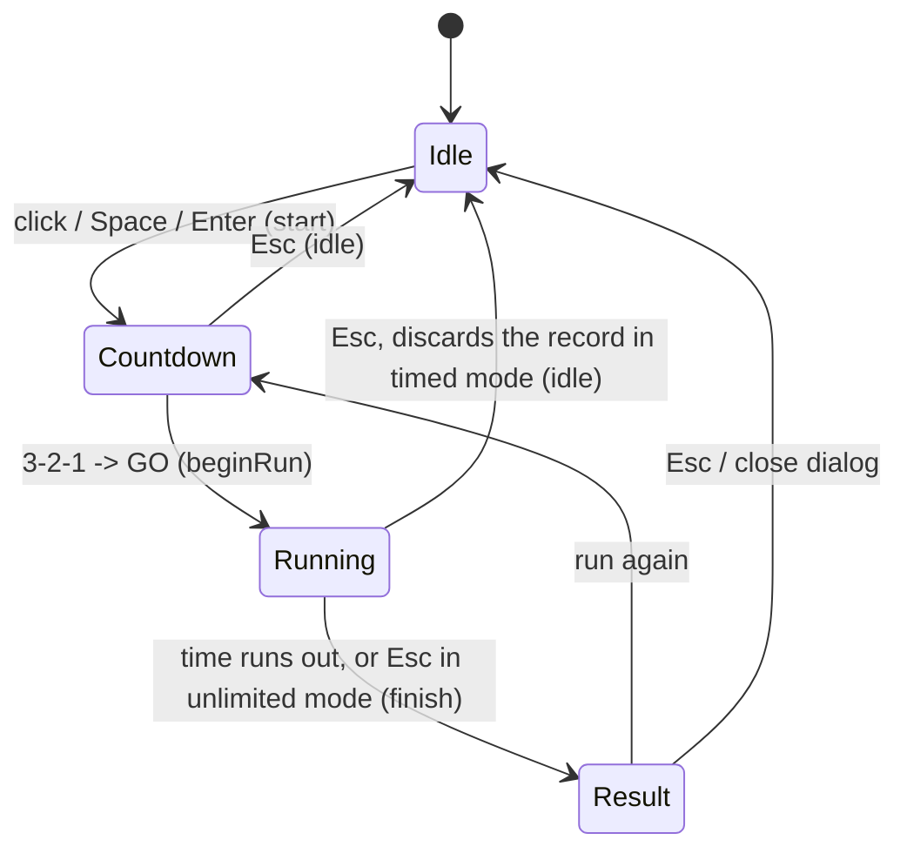
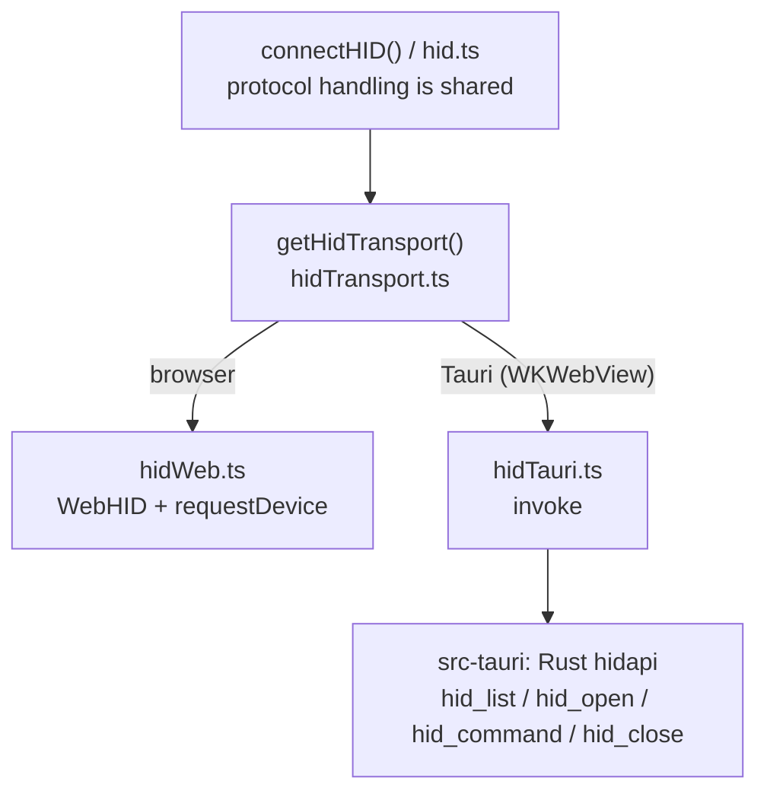
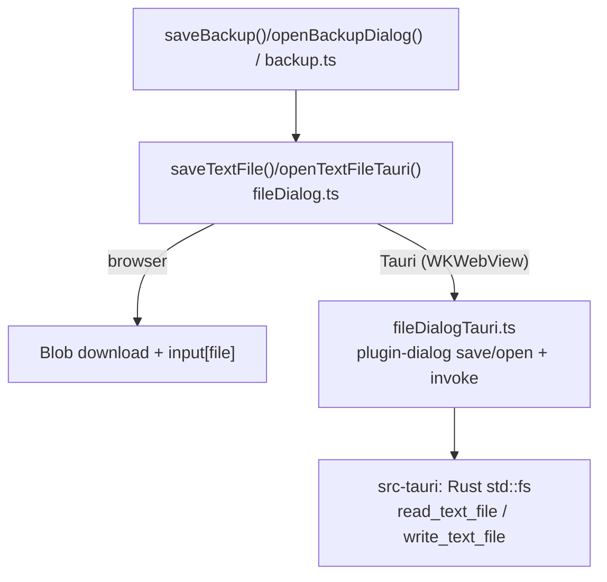

# Source Code Overview

*[日本語](app-overview-ja.md)*

The Vial Typing application itself. It reads the layout definition and keymap from a Vial-compatible
keyboard and guides typing practice by indicating "the next physical key to press."
Built with Vite + React + TypeScript; `npm run build` bundles it into `dist/`.
The practice corpus data (`src/data/*.json`) and the xz/lzma decoder (an npm dependency) are also
included in the bundle, so there's no external fetch at runtime.

## Architecture

State is held as plain mutable objects by the modules in `src/lib/`. After a change, calling
`invalidate()` (`lib/store.ts`) triggers React to re-render via `useSyncExternalStore`.
Components (`src/components/`) just read state and render declaratively, holding almost no state
of their own. The engine and keymap logic don't depend on React, so they can be unit-tested and
reused independently.

## src/lib/ — Logic and state

| Module | Role |
|---|---|
| `store.ts` | Re-render notification (`invalidate`/`subscribe`) and shared UI state `ui` (status pill, read log, drop indicator) |
| `backup.ts` | Writes/reads the current state (keymap + practice records) to/from a single JSON file. Used to migrate state between devices/browsers (details below) |
| `platform.ts` | Runtime detection `isTauri()` (whether `__TAURI_INTERNALS__` exists). Used to switch dynamic imports of Tauri-only modules |
| `fileDialog.ts` | Abstraction for saving/loading text files, `saveTextFile()`/`openTextFileTauri()`. Web = Blob/`<input>`, Tauri = OS dialog |
| `fileDialogTauri.ts` | Tauri implementation. Picks a path via the `plugin-dialog` save/open panel; reads/writes are `invoke`d to custom Rust commands. Dynamically imported only when isTauri |
| `settings.ts` | User settings `settings` (layout interpretation, input guidance, romaji style, sound effects, play time) and restoration from localStorage |
| `data.ts` | Imports the practice corpus (English words/sentences, Japanese words/sentences, symbol lines) |
| `layout.ts` | Types for KLE data and `parseKLE()` (conversion to a physical key layout) |
| `keycodes.ts` | HID/QMK keycode tables, `decodeNum()`/`parseVil()` (numeric/.vil string → `KeyDef`), keycap legend `legendFor()` |
| `defaultKeyboard.ts` | Default keyboard `DEFAULT_KEYBOARD` used when no keymap is loaded (standard US tenkeyless 61-key layout, 1 layer) |
| `romaji.ts` | Kana → romaji candidate table `ROMAJI`, style switching `applyRomajiStyle()`, `tokenizeKana()` |
| `kb.ts` | Keyboard state `KB` (physical layout + keymap + displayed layer), save/restore, reverse lookup `findKeyForChar()`, finger number `fingerFor()` |
| `guided.ts` | Key-mastery mode statistics, per-course unlock judgment, and practice pools (details below) |
| `engine.ts` | Practice engine `engine` (a state machine for a run; details below) |
| `hid.ts` | Reads the keymap over the Vial/VIA protocol via `connectHID()`; imports `.vil`/vial.json via `loadVilText()`. Sends/receives through `HidTransport` |
| `hidTransport.ts` | Abstraction and runtime selection of the HID transport, `getHidTransport()` (see "Desktop support" below) |
| `hidWeb.ts` | WebHID (Chrome/Edge) implementation. Selects a device via the native `requestDevice` dialog |
| `hidTauri.ts` | Tauri implementation. Delegates to the Rust side (hidapi) via `invoke`. Dynamically imported only when isTauri |
| `devicePicker.ts` | Bridges the device-selection UI for Tauri (`requestDevicePick` returns a Promise) |
| `audio.ts` | Sound effect synthesis via WebAudio (no asset files) |
| `hint.ts` | Derives "the next character to type and how to type it," `currentExpected()` |

### Reverse lookup and finger numbers (kb.ts)

- `findKeyForChar()`: character → `{key, layer, shiftKey, layerKey, alt}`. Scores candidates across
  all layers (weighted by hold count, layer depth, and the `keyPref`/`layerPref` settings) and returns
  the best match plus an alternative. Memoized in `charCache`, discarded when settings or the keymap
  change.
- `findShiftKey()`: if Shift only exists before the layer switch, it's treated as "Shift pressed first"
  (`fromBase`).
- `fingerFor()`: estimates the finger number (1=thumb through 5=pinky, piano-fingering style) from the
  physical layout. Splits left/right at the board's center; for split boards, the last row of each half
  is the thumb; the rest is assigned column by column from the inside out — index finger × 2 columns,
  middle, ring, and the outer columns to the pinky.

### Key-mastery mode (guided.ts) — keybr.com-style key unlocking

A port of keybr.com's guided lesson. Treats each run as one lesson, tracking per-key keystroke
statistics, and "unlocks" keys in order of mastery, changing the prompts as it goes. Normal ⇔
key-mastery is a mode switch (`engine.guided`), orthogonal to and combinable with the practice mode
(English/Japanese/symbols/mixed).

- Courses (`GUIDED_COURSES`): the unlock order is a "course" per practice mode = the target key set
  plus its frequency order in that corpus. English uses letter frequency from English words +
  sentences; Japanese uses letter frequency from Japanese words converted to standard romaji; the
  symbol course has two tracks, a letter track and a symbol/number track, both from the symbol-line
  corpus. **Keystroke statistics are shared across courses** — only the unlocked set and focus key
  differ per course.
- Statistics: each run records `[keystroke count, miss count, average keystroke time]` per key
  (`guidedRecordRun`). Current speed is exponentially smoothed across runs (`GUIDED_ALPHA = 0.1`); the
  personal best is its minimum (`guidedRebuildStats`).
- Confidence: `target keystroke time ÷ smoothed keystroke time`. The target is 175 CPM = 35 WPM
  (`GUIDED_TARGET_TIME`). 1.0 or above counts as "mastered."
- Unlock judgment (`guidedTrackKeys`): scans each track in frequency order — ① the first 6 keys are
  always unlocked, ② a key that reaches personal-best confidence 1.0 stays unlocked, ③ the next single
  key is unlocked only once every unlocked key has reached 1.0. The weakest key becomes the "focus key."
- Prompts (`guidedBuildPools`): builds a pool from each course's unlocked set. Shortfalls are filled
  with generated lines — pseudo-words, pseudo-kana, and identifiers joined with unlocked symbols. Mixed
  mode uses the matching course's pool for each prompt type.
- Persistence: the last 300 runs are saved to localStorage under `vialTypingGuided`.

### Practice engine (engine.ts)

The `engine` object is a state machine holding all state for a run. It never touches the DOM —
the type line, stats, and hints are all derived from state on the component side.

- Prompts: `makeItem()` picks one depending on the mode (en/jp/sym/mix). During key-mastery mode it
  swaps in the pool of unlocked keys. `drawFrom()` draws from a shuffled bag to avoid bias and
  consecutive repeats.
- Input: `input()` → `inputText()` for Latin-script modes / `inputJP()` for Japanese. Japanese matches
  romaji candidates by prefix per unit, including handling a single "n" keystroke committing "ん"
  (`softDone` → `finishUnit`). `expect()` returns the next single character to type, used by the hint
  display and keystroke recording (`recordStep`).
- Run control: `start()` (countdown) → `beginRun()` → `tick()` every 100ms →
  `finish()` (tallies the score and sets `result`; key-mastery mode also commits keystroke records) /
  `idle()`.
- Combo bonus: +1 second every 30 consecutive correct keystrokes (not awarded in unlimited mode).
- `runSeconds`: 30/60/90 seconds; 0 is unlimited (ends with Esc and shows the result).

### State backup (backup.ts)

Since localStorage is isolated per origin (not shared between the web version, the Tauri version, and
different browsers), the current state can be written out to a single JSON file to move it to another
environment.

- Scope: **keymap** (`kb.ts`'s `keymapSnapshot()` — the same shape as localStorage `vialTypingKeymap`),
  **practice records** (`guided.ts`'s run history), and **settings** (the full `cornix*` set in
  `settings.ts`). Settings are applied first (so a fixed layer carries into the layer-count check when
  applying the keymap), then the keymap and practice records are imported, and finally `engine.idle()`
  resets the run.
- File format: `{ app:"vial-typing", kind:"backup", version, exportedAt, keymap, guided, settings }`.
  **The top-level `version` is the format version**, always set on export. On import,
  `migrateBackup()` checks `version` and migrates to the current format; a backup with a `version`
  newer than the current one is not restored (to avoid a broken restore on an older app version).
- Restoring **replaces** the current keymap and practice records. A confirmation dialog only appears
  when it would erase existing practice records. The imported keymap is also saved to localStorage and
  auto-restored on the next launch.
- Entry points: the `Header`'s "💾 Save"/"📂 Restore" buttons, and the same drag-and-drop as
  `.vil`/vial.json. On drop/file selection, `loadFileText()` inspects the contents and routes to
  `importBackup()` for a backup, or to `loadVilText()` as `.vil`/vial.json otherwise.
- Save/load file I/O is abstracted in `fileDialog.ts`, switching implementation via `isTauri()`: the
  browser uses a `Blob` download and `<input type=file>`; Tauri uses the OS-native save/open dialog
  (`plugin-dialog`) plus custom Rust commands. Saving is `saveBackup()`; Tauri's restore is
  `openBackupDialog()`.

## src/components/ — React components

| Component | Renders |
|---|---|
| `useApp.ts` | Hook that subscribes to `invalidate()` (`useSyncExternalStore`; `App` subscribes and re-renders the whole tree) |
| `App.tsx` | Overall layout, global keydown/drag-and-drop, automatic display-layer switching |
| `Header.tsx` | Title, status pill, read/open/clear buttons |
| `Toolbar.tsx` | Mode switch, practice mode, play time, and the settings selects |
| `StatBar.tsx` | Time remaining (or elapsed)/WPM/accuracy/combo/misses/the "+1s" popup |
| `GuidedPanel.tsx` | Key-mastery panel (course tabs, key chips, details, chart) |
| `keyChartDraw.ts` | Canvas drawing for the per-key speed history chart (scatter plot + smoothed curve + target line) |
| `TypePanel.tsx` | Prompt display, type line, action hint chip (with finger number), next-word queue |
| `KeyboardPanel.tsx` | Keyboard diagram (key layout, legends, highlight, finger-number badge), read log |
| `ResultDialog.tsx` | Result dialog (score, rank, key-unlock announcement) |

Re-rendering runs across the whole tree on every keystroke and every 100ms timer tick, but this isn't
an issue since the UI is small. Only the canvas chart uses the selected key's object identity as an
effect dependency, re-drawing only when the stats change. The keyboard board is also `useMemo`'d
(depending on the hint, keymap reference, layer, and container width), so it isn't rebuilt on every
tick.

## Styles

Shared styles (theme variables, reset, page skeleton, common button styles) live in
`src/styles/base.css`, imported first by `main.tsx` to fix the base of the cascade. Component-specific
styles live next to each component as `src/components/<Name>.css`, imported by its `.tsx` file
(colocation). Class names remain global, so this doesn't affect E2E test selectors or DOM structure.

## Startup (src/main.tsx)

Loads key-mastery mode history (`guidedLoad` → `guidedRebuildStats` → `guidedUpdateKeys`) →
restores the saved keymap (`restoreSavedKeymap`; falls back to the default US keyboard
`lib/defaultKeyboard.ts` if none exists) → mounts `<App />` via `createRoot`. All subsequent screen
updates go through `invalidate()`.

## Desktop support (Tauri / macOS)

The same frontend can also be wrapped with Tauri into a macOS app (.app) (`src-tauri/`). The catch is
that **WKWebView doesn't support WebHID** — `navigator.hid` doesn't exist. So only the HID access is
abstracted as a transport:

- At runtime, the web/Tauri implementation is chosen by whether `__TAURI_INTERNALS__` exists. The
  Tauri implementation is a dynamic import, so **`@tauri-apps/api` isn't included in the web bundle**
  (the same code-splitting as xz/lzma).
- Protocol handling (reading the FE00/01/02 definitions, layer count, keymap buffer, retries,
  immediate close) stays as a single transport-independent implementation. The only difference is the
  "send 32 bytes, wait for 1 report" interface.
- The Rust side (`src-tauri/src/lib.rs`) enumerates/opens/closes devices with usage_page=0xFF60/
  usage=0x61 via `hidapi`, with `hid_command` as the 4 commands doing `write` + `read_timeout`. Since
  there's no Chrome device-picker dialog, the `DevicePicker` component shows a selection dialog when
  there are multiple devices.
- Launch: `npm run tauri:dev`; build: `npm run tauri:build` (wraps `dist/` into a .app/.dmg).
- Since localStorage is per-origin, the web version and the app version don't share mastery history or
  the saved keymap. The migration path for this is the state backup (`backup.ts`); file save/load also
  switches implementation at runtime the same way.

**File save/open uses the same kind of abstraction** (`fileDialog.ts`). WKWebView doesn't support
`Blob` downloads, and drop is disabled by `dragDropEnabled:false`, so it's swapped for an OS-native
panel under Tauri:

- The panel is shown via Tauri's official `dialog` plugin (`@tauri-apps/plugin-dialog` /
  `tauri-plugin-dialog`; capability `dialog:default`). File I/O uses custom commands just like HID, so
  no extra permission is needed.
- The Tauri implementation (`fileDialogTauri.ts`) is a dynamic import; `@tauri-apps/plugin-dialog`
  isn't included in the web bundle.
- Restoring on the web directly clicks `<input type=file>` (preserving the user gesture); Tauri uses
  the open dialog.

## localStorage keys

| Key | Contents |
|---|---|
| `vialTypingKeymap` | The read layout definition + keymap (auto-restored next launch) |
| `vialTypingGuided` | Key-mastery mode run history (last 300 entries) |
| `cornixTime` | Play time (0/30/60/90) |
| `cornixOutMode` | Layout interpretation (us/jis) |
| `cornixPref` | Input guidance preference (auto/shift/layer) |
| `cornixRomaji` | Romaji guidance style (hepburn/kunrei) |
| `cornixNumLayer` / `cornixSymLayer` | Fixed layer for numbers/symbols |
| `cornixSound` | Sound effects on/off |
